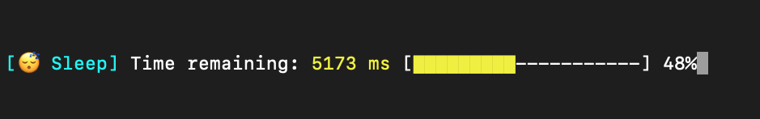

# SleepTimer



SleepTimer is a Python package that provides a sleep timer with a live timer and progress bar. It allows you to perform sleep operations with an active timer and visually track the progress using a customizable progress bar.

## Installation

You can install SleepTimer using pip:

```shell
$ pip install sleeptimer
````

## Usage

Here's an example of how to use SleepTimer in your Python script:

```python
from sleeptimer import sleep

# Set the sleep duration in seconds
duration = 10

# Start the sleep timer
sleep(duration)

# Sleep timer completed
print("Sleep timer finished!")
````

The sleep() function accepts the following options with their default values:

| Option	        | Default Value | Description                                               |
| ----------------- | ------------- | --------------------------------------------------------- |
| seconds | (required) | Sleep duration in seconds. |
| title | "😴 Sleep" | Title text displayed before the timer. |
| message | "Time remaining: " | Message text displayed before the time remaining. |
| show_progress_bar	| True | Whether to show the progress bar or not. |

You can customize these options as needed to suit your requirements. For example, you can change the title, message, or disable the progress bar by setting show_progress_bar=False.

## Contributing

Contributions are welcome! If you have any bug reports, feature requests, or suggestions, please open an issue on the GitHub repository. You can also submit pull requests with improvements to the codebase.

## License

SleepTimer is licensed under the [MIT](https://choosealicense.com/licenses/mit/) License.

